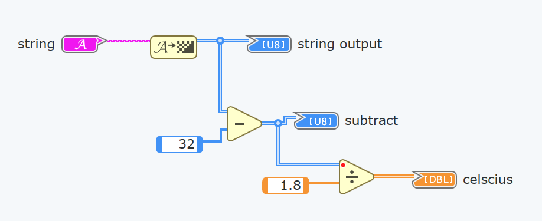
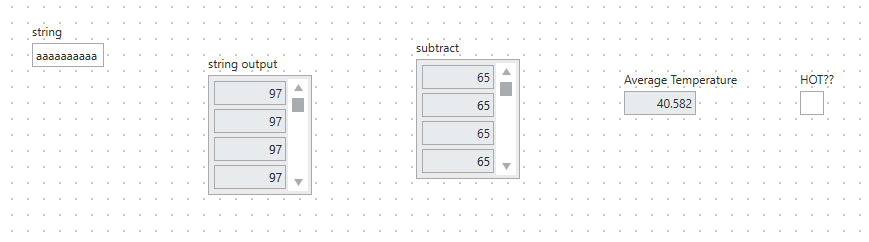

# Converting from Fahrenheit to Celsius
The first task is to take a string as an input, convert each character into an integer using ASCII and store that in an array. Then convert each of those integers from fahrenheit to celsius using the formula 
$$celsius = (fahrenheit - 32) / (1.8)$$

First, the conversion into celsius is done by subtracting each fahrenheit value by 32. Then, we divide each of those values by 1.8. The divide operation must be done in floating point. The diagram below shows the full circuit which converts a string into a number of celsius values

Here is the result of running the simulation

Now, we can compute the average temperature by diving the sum by the number of elements in the array

We can check if it's hot by seeing if the average temperature is greater than 50

# Task 2: Central limit theorem

We can observe the central limit theorem using a mixture of count controlled loops and condition controlled loops. 

In the image above, a 2D array of randomly generated numbers (between 0-1) are generated using a nested for loop. The total number of elements is the product of each loop's "N" value. In this case, 10 * 10 = 100. Therefore, we divide the sum of the elements by 100 to obtain our sample mean. The program will then repeat this process to produe a different sample mean until the "stop" button is pressed".

The following image shows the result of running.

the sample mean (in this case 0.500562) is very close to the expected value (0.5). Most samples are expected to have a mean very close to the theoretical mean.

The results over time can be viewed using a histogram, we need to start by storing the sample mean from each iteration using an array. This can then be used as an input to the "signal" node on the histogram component. The "number of bins" node on the histogram refers to 

An initial simulation with the number of bins set to 100 gives the following result

You can see clearly that most of the data is concentrated around ~0.5 and the overall shape of the curve resembles the gaussian distribution.

The next step would be to end the while loop when it has iterated a certain number of times. This can simply be done by comparing "i" with the total number of iterations.

Now The simulation will be carried out again but this time, the number of bins = 10 and the number of iterations has been set to 1000

Now, we'd like to change the code so the final distribution observed is a histogram that is standard normal. The mean must be 0 and the standard deviation must be 1.

We can convert out distribution to a normal distribution using the following formula

$$Z = (X-\mu)/\sigma$$

This formula can either by applied after the sample mean has been taken, or during the sampling.

In both cases $$\mu = 0.5$$

However the standard deviation will be different.

During the sampling process

$$\sigma = (1-0)/\sqrt12 = 1/\sqrt12$$

After the samples have been taken

$$\sigma = (1-0)/(\sqrt(12n)) = 1/(10\sqrt12)$$

Therefore, the formula is

$$Z = (X - 0.5)(\sqrt(12n)) $$

where n = 1 if the formula is applied during sampling, and n = 100 if the formula is applied after sampling.

### Applying after sampling

### Applying during sampling